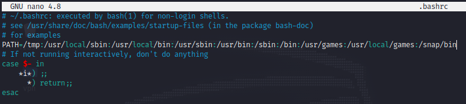

# TryHackMe - Eavesdropper
  
Room Link => [Eavesdropper](https://tryhackme.com/room/eavesdropper)  
#### There are two ways to solve this machine.
- Intended Way  
- Unintended Way  

#### You can follow the steps below to solve it using the intended way or you can check out another writeup by `xyro` who found an unintended way to solve this machine which is something very few people would have found and his approach to solve this machine is also unique. Link to his write is here => [Xyro's Writeup](http://xyro.codes/THM/eavesdropper/writeup.html)

<p>
    <strong>Intended way :</strong>
    <ul>
        <li>
            <strong>Step 1 :</strong><br>
            LogIn to the machine using <code>idrsa.id-rsa</code> provided in task 1 with username <code>frank</code>.
        </li>
        <li>
            <strong>Step 2 :</strong><br>
            Transfer <code>pspy</code> onto the target machine and run it for a while.<br>
            There are a few things we notice.<br>
            User frank is logging in via ssh and then running the command <code>sudo cat /etc/shadow</code><br>
            We can perform <code>sudo hijacking</code> on this.
        </li>
        <li>
            <strong>Step 3 :</strong><br>
            Time for <a href="https://book.hacktricks.xyz/linux-hardening/privilege-escalation#sudo-hijacking">sudo
                hijacking</a>.
            While creating our sudo executable, we have to be a little bit creative. Trying to get a reverse shell won't
            be useful. If u hijack sudo so that it spawns a reverse shell instead, the reverse shell u get back would be of
            the frank user because the sudo elevation hasn't happened yet. Instead we can capture the password entered by
            frank using a little bit of shell scripting. (Thanks you xyro for these words 😁).<br>
            Follow these steps to capture the password using our sudo executable.
            <ol>
                <li>
                    <code>touch /tmp/sudo</code> creating our own sudo executable.
                </li>
                <li>content of sudo file <br>  
```   
        #!/bin/bash  
        read -s pass # after executes the command, this will read the password entered by frank and store it in the pass variable  
        echo $pass > /home/frank/pass.txt # echoing the password from pass variable to pass.txt so that we can read it once catured.    
```
                </li>
                <li>
                    <code>chmod +x /tmp/sudo</code>
                </li>
                <li>
                    Modify you <code>$PATH</code> variable using <code>.bashrc</code> <br>
                     <br>
                    Save the changes and wait for a few seconds after which you will see a pass.txt which has the password
                    that can be used to switch to root.
                </li>
            </ol>
        </li>
        <li>
            <strong>Step 4 :</strong><br>
            Copy the password from pass.txt and do <code>/usr/bin/sudo su</code> and get the root flag.
        </li>
    </ul>
    <h1>
        Solved 😁
    </h1>
    <p>
        Once you are done with this. <br> Make sure to ckeck out <a href="http://xyro.codes/THM/eavesdropper/writeup.html">xyro's writeup</a><br>
        His method is super awesome 👍🏻
    </p>

</p>